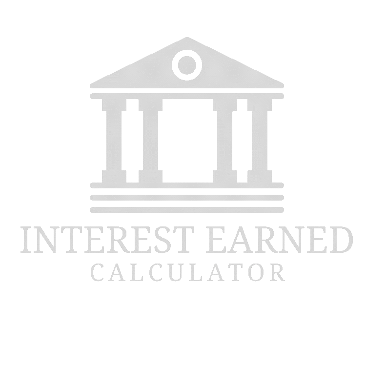

<h1 align="center"> Customer Banking Program</h1>

<h2 > <b>Week 3 of Artifical Intelligence Bootcamp</b></h2>

This week we were tasked using a Class in python to create a banking program that calculates interest earned based on a customer's input.

<h2> 🗃️ Project Files </h2>

 This program contains 1 executable file and 3 modular files. 

<ul>
    <li><b>customer_banking.py | Executable </b></li>   
    The main project file which takes in user input and passes it through the class created in Account.py, which is imported into both cd_account.py and saving_account.py. Returning two values, the interest earned on the account and the updated acccount balance.
    

    <li><b>Account.py | Modular File</b></li>    
    Holds all banking account functions, used in for calculating interest and updating account balance.
    <li><b>savings_account.py | Modular File</b></li> 
    Using an instance of the Account class, we pass in user input into to calculate interest earned on a customer's savings account and returns the interest earned and the updated account balance.
    <li><b>cd_account.py | Modular File</b></li> Using an instance of the Account class, we pass in user input into to calculate interest earned on a customer's cd account and returns the interest earned and the updated account balance.

<h2> 🌟 Features </h2>
<b>Agile Practices</b> - Use of a class and functions to promote readability, reusability, and encapsulation.
<b>User-friendly</b> - Easy for users to interact with program.

<h2> 📝 Execution Steps </h2>
<ol>
    <li>If you have not done so already, CLONE git repository: </li> > git clone https://github.com/ncmoliver/customer_banking.git
    <li>RUN <b>customer_banking.py</b> to start the program.</li>
</ol>
<h2> :clipboard: References</h2>
<ul>
    <li>
UNC Bootcamp Spot, 'Xpert Learning Assistant', [Online]
</li>
    
Source: https://bootcampspot.instructure.com/courses/6028/external_tools/313

    <li>
 'ASCII Art Archive',  [Online]
</li>
    
Source: https://www.asciiart.eu/

    <li>
Mohammad Amin Shamshiri, 'Span-Detector, README.md', [Online]
</li>
    
Source: https://github.com/ma-shamshiri/Spam-Detector/blob/master/README.md?plain=1

</ul>

<h2>©️ Credits</h2>
Marques K Oliver
